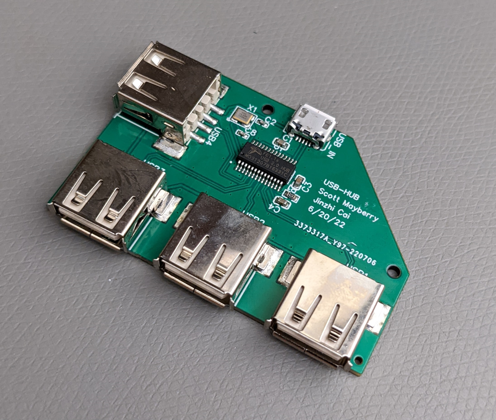
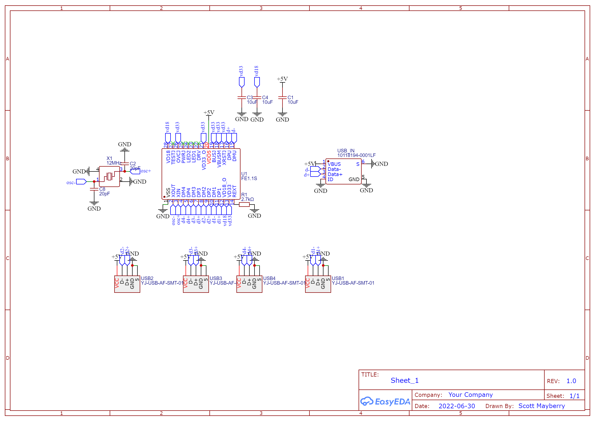
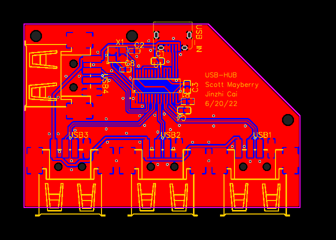

# usb-hub-module

Usb hub circuit ready-to-use or for integration into other projects. Uses FE1.1s and surface mount components.

Fabrication files (gerber, BOM, and pick and place) are located in the [fabrication](fabrication/) folder. I succesfully manufactured these using https://JLCPCB.com.

[EasyEda](easyeda/) folder contains the zip file of the project which can be uploaded to the online editor at https://easyeda.com/editor for modification.

The project is also easily available at OSHWLAB: https://oshwlab.com/sctmayberry/usb_hub_rpi_zero

# Schematic

# PCB
